# 论文管理系统参考文档

## 项目简介

本项目为华东师范大学软件工程学院，数据库实践第三小组的项目参考文档。项目组成员为：龚思陈、杨政、姜莹颖。

项目实现了论文管理、用户管理、论文下的笔记、评论等管理的相关功能，提供乐一套可运行的论文管理方案。

项目一共分为两套系统，分别为前台和后台（管理员界面）；系统有三个角色，分别为管理员、超级管理员、普通用户。

## 运行说明

### 运行环境

python3, flask, node.js

### 代码说明

- flaskProject：有关后端的代码
  - app：主文件夹
    - api：所有的api实现函数都写在这个包里面，按照不同的功能分在了不同的py文件中
    - util：辅助包
  - files：有关文件收发操作的包
  - config.py：系统设置（数据库配置、邮箱配置...）
  - mock.py：数据库假数据生成文件
  - requirement.txt：后端需要安装的依赖包文件
  - manage.py：项目主文件，也是承载了所有路由入口的文件。
- vue有关前端的代码
  - vue/src：主文件夹
    - api：api.js存放了所有前端用到的inapi
    - views：前端页面的vue文件
    - main.js：主要函数（前端项目入口）
    - App.vue：前端项目主vue文件
    - route.js：路由文件
    - ...其他
  - package.json：依赖包

### 运行步骤

- 后端：打开终端，进入flaskProject目录，输入命令pip3 install -r requirement.txt，下载依赖包，运行manage.py文件即可。

  附注：可能会报运行错误。这是由于flask-sqlchemy和openGauss不兼容的原因。点击进入报错的最后一个文件，注释掉raise的地方，改为return(8, 2)即可

- 前端：打开终端，进入vue目录，npm install 下载依赖包。npm run dev运行即可。

## 项目页面

### 普通用户-论文管理系统

#### 登录界面

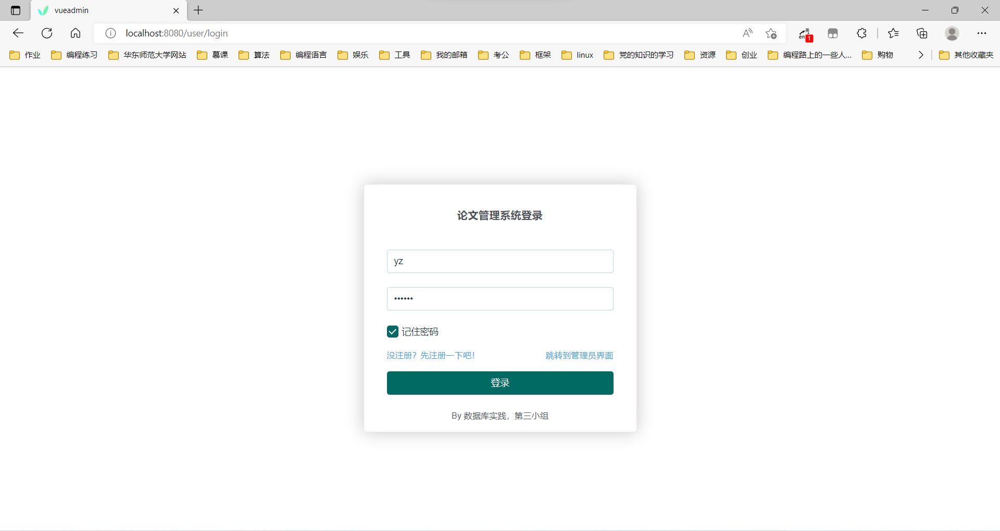

1. **主要功能**：实现了用户名+密码的形式登录的登陆模式；实现了路由拦截的功能，对所有页面均需登录后方可访问；可记住密码；输入均存在非空限制。
2. **页面跳转**：可跳转到，注册界面和管理员界面
3. **源代码可见**：UserLogin.vue

#### 注册界面

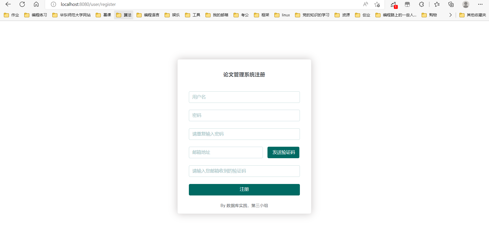

1. **主要功能**：实现用户名+密码+邮箱验证注册；对于用户名有不重名检测，对于密码有长度限制，对于邮箱有规范格式限制；均存在非空限制。
2. **页面跳转**：无
3. **源代码可见**：UserRegister.vue

#### 论文汇总（论文广场）界面

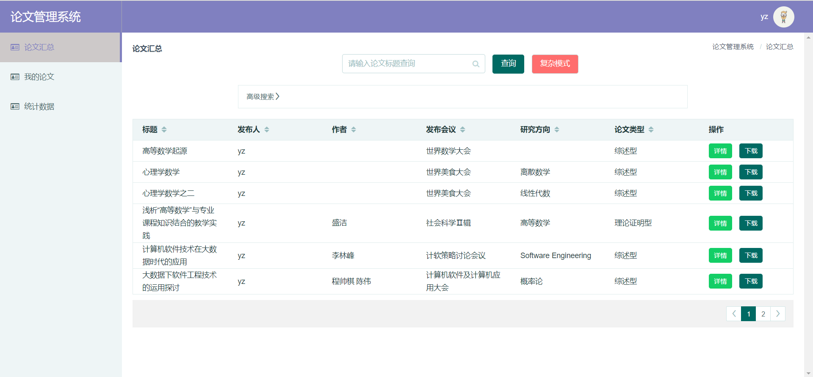

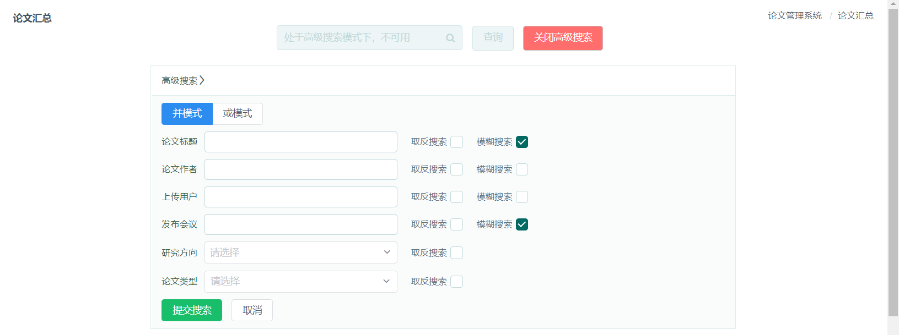

1. **主要功能**：点击侧栏中“论文汇总”，可以跳转到论文汇总界面。该页面可以查询到所有用户在该平台上传的所有论文。

   - 查论文：

     - 简单查询：点击搜索框，使用论文标题进行模糊查询；

     - 复杂查询：点击按钮切换到复杂模式。点击搜索框，输入多个论文标题以空格为间隔进行模糊查询，多个论文标题之间是或条件；

     - 高级搜索：点击高级搜索折叠面板，切换到高级搜索模式。

       - 并模式与或模式

         以论文标题（《高等数学起源》）和发布人（杨政）为例：

         若选择了并模式，则会搜索出论文标题为《高等数学起源》并且发布人为杨政的所有论文。

         若选择了或模式，则会搜索出论文标题为《高等数学起源》或者发布人为杨政的所有论文。

       - 对于每个条件的限制

         对于每个条件都可选择取反搜索和模糊搜索的选项（**两个模式可同时使用**）

         以论文标题（《高等数学起源》）为例，若选择了取反和模糊搜索，则会搜索出**除去了**标题包含《高等数学起源》的所有论文。

       - 附注：上述两项功能可组合使用

   - 下载：点击下载按钮可下载论文的的正文文件（若已上传），若未上传则会返回错误提示。

2. **页面跳转**：无

3. **源代码可见**：PaperTable.vue

#### 统计数据界面

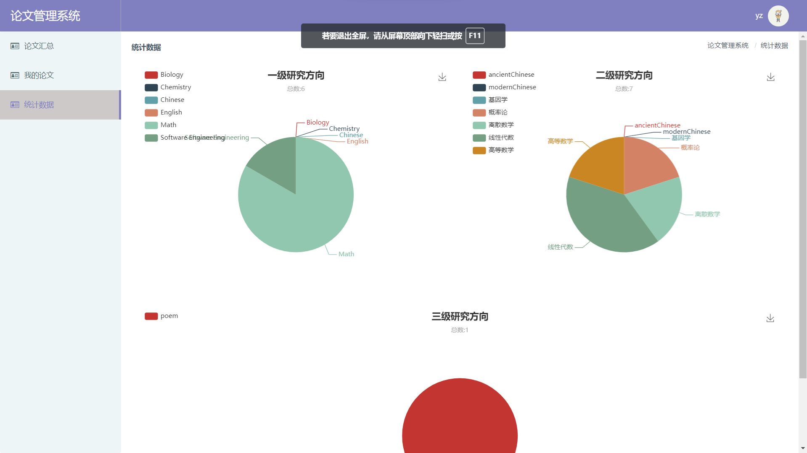

1. **主要功能**：点击侧栏中“统计数据”，可以跳转到统计数据界面。该页面展示了当前登录用户发布论文的统计数据。统计数据图表为：从论文一级研究方向到三级研究方向的分布饼状图
2. **页面跳转**：无
3. **源代码可见**：echarts.vue

#### 已发布论文界面

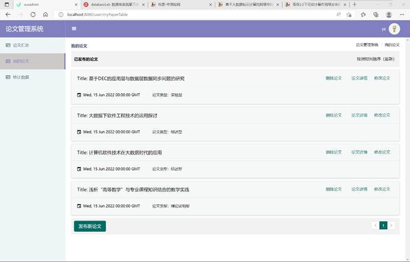

1. **主要功能**：点击侧栏中“我的论文”，可以跳转到我的论文界面，默认显示已发布论文列表，展示该用户已发布的所有论文信息。

   - 已发布的论文按发布时间顺序排序，最新发布的论文排列最前，并分页查看，点击对应页数可跳转到对应页数下的已发布论文条目；

   - 每一条已发布论文条目显示论文标题、论文发布时间即相应论文类型；

   - 每一条已发布论文条目对应有查看（点击论文详情可跳转），修改（点击修改论文可跳转），删除（点击删除论文可删除该篇论文并实时更新已发布论文列表）等功能；

     

2. **页面跳转**：

   - 点击“已发布论文”界面底部的“发布新论文”，可跳转到发布论文界面；
   - 点击每一条论文条目对应的“修改论文”，即可跳转到该论文的修改论文界面；
   - 选择想要查看的已发布论文条目对应的“论文详情”，即可跳转到该论文的论文详情界面；

3. **源代码可见**：UserPaper.vue

#### 发布论文界面

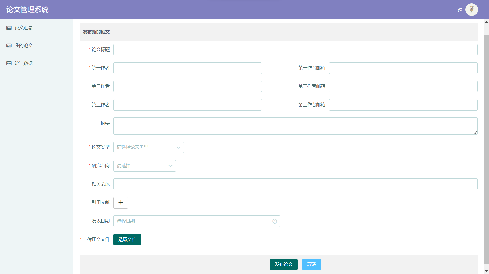

1. **主要功能**：点击侧栏中“我的论文”，可以跳转到我的论文界面，默认显示已发布论文列表，展示该用户已发布的所有论文信息。

   - 用户填写论文标题，第一作者名称（必填），第一作者邮箱，第二作者，第二作者邮箱，第三作者，第三作者邮箱，摘要，论文类型，研究方向，论文相关会议，引用文献，论文发表日期，上传正文文件（必填），上传附加文件，填写笔记等......新增一篇论文。

   - 论文类型和研究方向采取下拉款选择形式输入：

     点击论文类型下拉框，将出现已有的五种论文类型，点击选择即可；点击研究方向下拉框，将出现第一层级研究方向，可逐级点击遍历完整研究方向树形结构，选择对应研究方向；

   - 上传正文文件，点击选取文件，将会浏览电脑已有文件，选中需要上传的文件即可上传成功。

   - 填写引用论文时，点击加号，输入需要引用的论文标题，系统将会判断该论文是否已存于系统中，如果没有，将会返回“该引用论文不存在“的消息提醒论文发布者，重现填写引用论文；点击减号，即可删除该引用论文；

2. **页面跳转**：点击底部“取消”可以退出发布新论文界面，返回到“已发布论文”界面。点击“发布论文”，若发布成功，返回到“已发布论文”界面；若不成功，弹出错误提示。

3. **源代码可见**：PublishPaper.vue

#### 修改论文界面

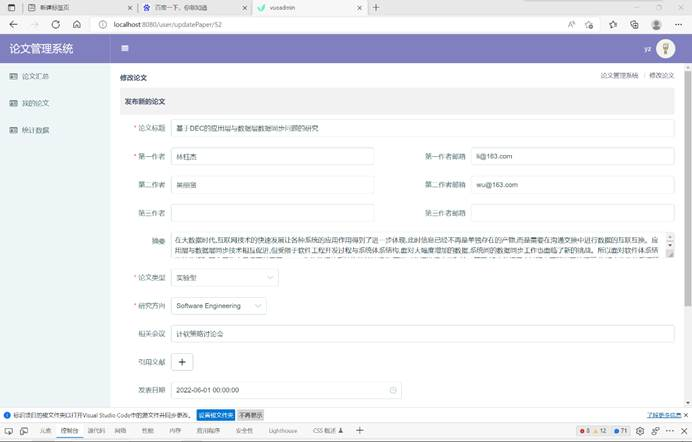

1. **主要功能**：从“已发布论文”界面，点击每一条论文条目对应的“修改论文”，即可跳转到该论文的修改论文界面；
   - 论文信息填写框将会显示该论文已提交的相应信息，用户可以选择想要修改的信息进行修改，相应操作与发布论文界面一致；
2. **页面跳转**：与发布论文界面一致
3. **源代码可见**：PaperUpdate.vue

#### 论文详情界面

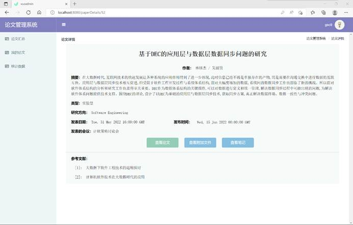

1. **主要功能**：在“已发布论文”界面，选择想要查看的已发布论文条目对应的“论文详情”，即可跳转到该论文的论文详情界面；
   - 论文信息填写框将会显示该论文已提交的相应信息，用户可以选择想要修改的信息进行修改，相应操作与发布论文界面一致；
   - 在论文详情界面，可以查看该论文的标题，作者（以第一、第二、三级作者顺序排序出现），摘要，类型，研究方向，论文发表日期，论文发布时间，论文相关会议，论文引用的参考文献等；
   - 点击中间“查看论文”，可以下载该论文的正文文件，并查看正文文件内容；
   - 点击中间“查看附加文件”，可以下载改论文的附加文件，并查看附加文件内容；
2. **页面跳转**：点击中间“查看笔记”，可以跳转到该论文的“笔记详情”界面，查看该论文对应的笔记及相关评论；
3. **源代码可见**：PaperDetailTable.vue

#### 笔记界面

##### 笔记页面

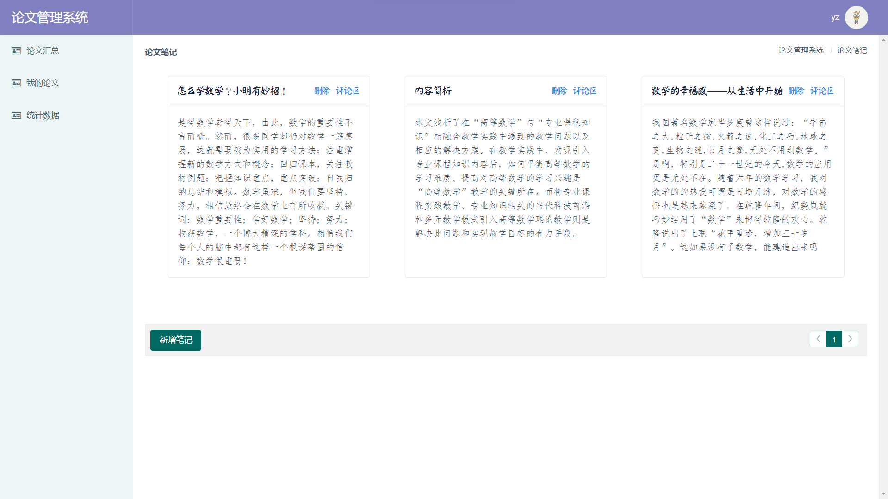

1. **主要功能**：在“笔记”界面，任何用户都可查看到这篇论文相关的功能。
   - 查：每页会展示3个笔记
   - 删：若为论文的发布者（根据需求，只有发布者才可以创建笔记），会显示删除按钮可供删除。
2. **页面跳转**：点击评论区会打开弹窗（但不是跳转）
3. **源代码可见**：NoteTable.vue

##### 评论区

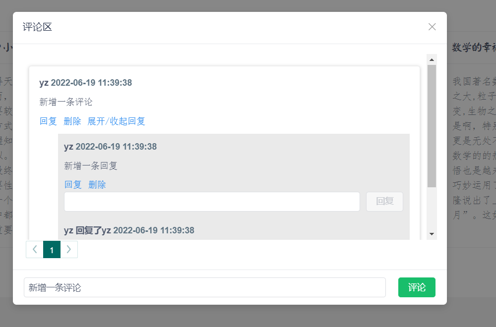

1. **主要功能**：点击笔记的评论可打开评论区弹窗

   - 展示评论区下的多条评论，评论下的多条回复。

     附注：回复是可以对评论的回复，也可以是对评论中某条回复的回复。

   - 输入回复或评论，提交。

2. **页面跳转**：点击评论或回复按钮，或点击x/评论区弹窗外，弹窗关闭。

3. **源代码可见**：NoteTable.vue

### 管理员-后台管理系统

#### 用户管理界面

- 源代码见UserTable.vue

- 点击侧栏中的“用户管理”，可以跳转至用户管理界面，默认显示所有用户列表，展示该用户的个人信息，可根据按钮进行以下具体操作：

##### 用户查询

- 默认显示所有用户的列表，按user_id的大小排序，即先注册的用户排列最前；

- 在上方输入框内输入需要查询的用户姓名，点击”查询“按钮，可查看对应用户；

  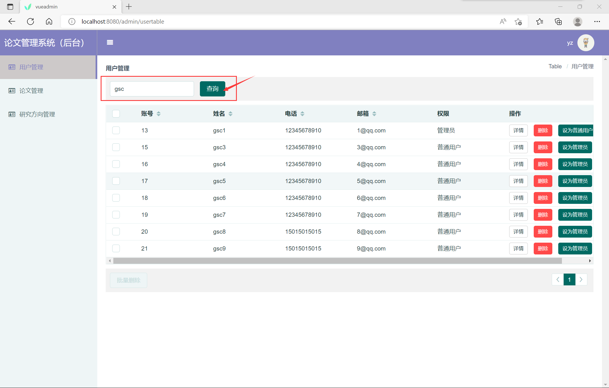

- 可分页，点击对应页数可跳转；

##### 查看每个用户的统计数据

- 点击目标用户“操作”一栏中的“详情”按钮，将跳转至该用户的统计数据，显示其在各个研究方向发文的数量；

  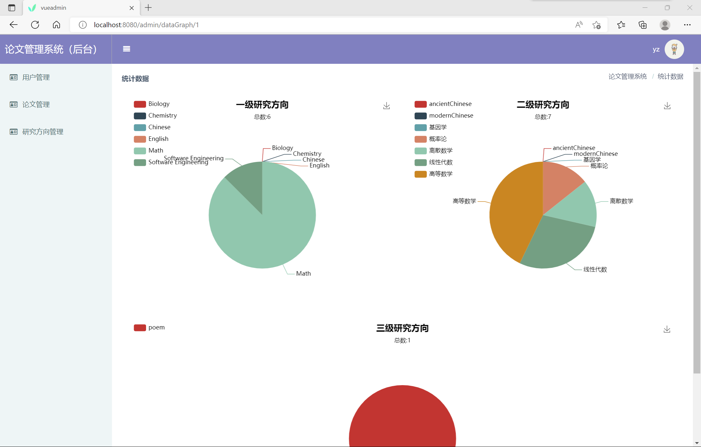

##### 权限控制

- 点击目标用户“操作”一栏中的“设为管理员/普通用户”（根据其本身的权限而定），会跳出提示的对话框，询问是否确定修改，点击是，即可修改用户权限；

##### 删除用户

- 删除单个用户
  - 点击目标用户“操作”一栏中的“删除”键，会跳出确认删除的对话框，点击“确认”即可删除用户；
- 批量删除用户
  - 选中多个用户前的复选框，“批量删除”键便使能亮起，点击“批量删除”键后，同时删除多个用户；

#### 研究方向管理界面

- 源代码见DomainTable.vue

- 点击侧栏中的“研究方向管理”，可以跳转至研究方向管理界面，默认显示所有研究方向，展示研究方向列表的树形结构。可根据按钮进行以下具体操作：

  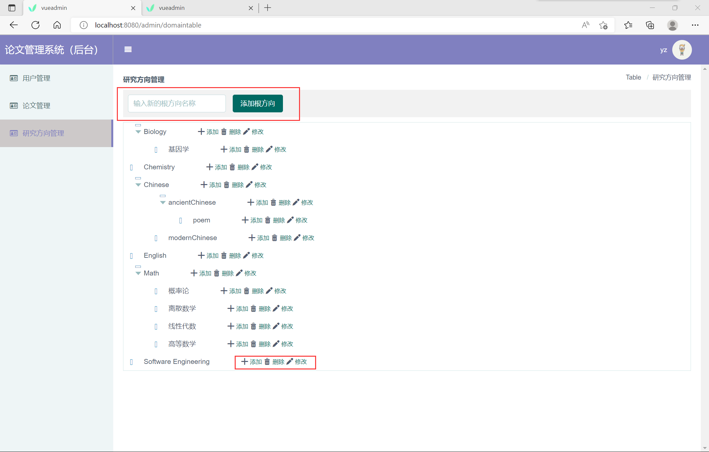

##### 增

- 根方向

  - 在顶部输入框内输入想要添加的根方向名称，点击“添加根方向”，系统提示”添加成功“后自动刷新页面，即可看到树形结构中添加了新的根节点；

- 子方向

  - 在对应的父结点处点击“添加”键，会跳出一个对话框，在对话框中输入想要添加的子节点的名称，就可在父结点下创建新的子节点；系统提示“添加成功”后自动刷新页面；

    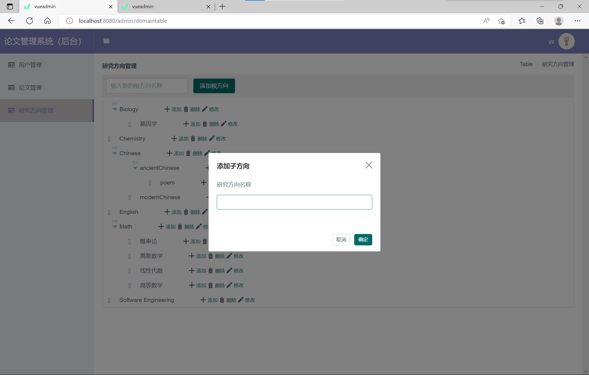

##### 删

- 点击目标节点对应行的“删除”键，在确认提示框中选择“确认删除”后，即可删除；
- **逻辑删除**
  - 若删除的节点下有依附的子节点，则子节点自动往上一层；被删除的节点实际上是逻辑删除；

##### 改

- 点击目标节点对应行的“修改”键，在跳出的对话框中输入修改后的新名称，点击“确定”提交修改；

  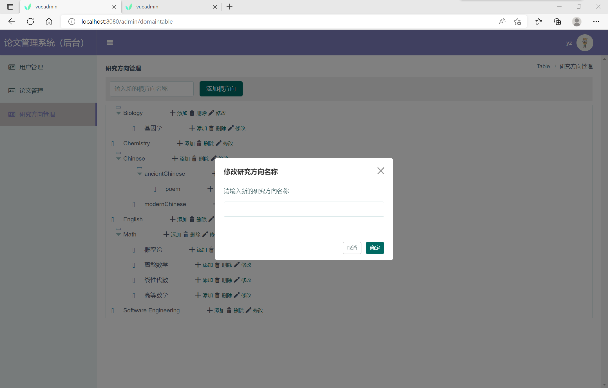

#### 登录界面

- 与普通用户系统基本相同，不再赘述